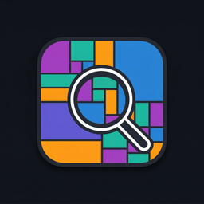
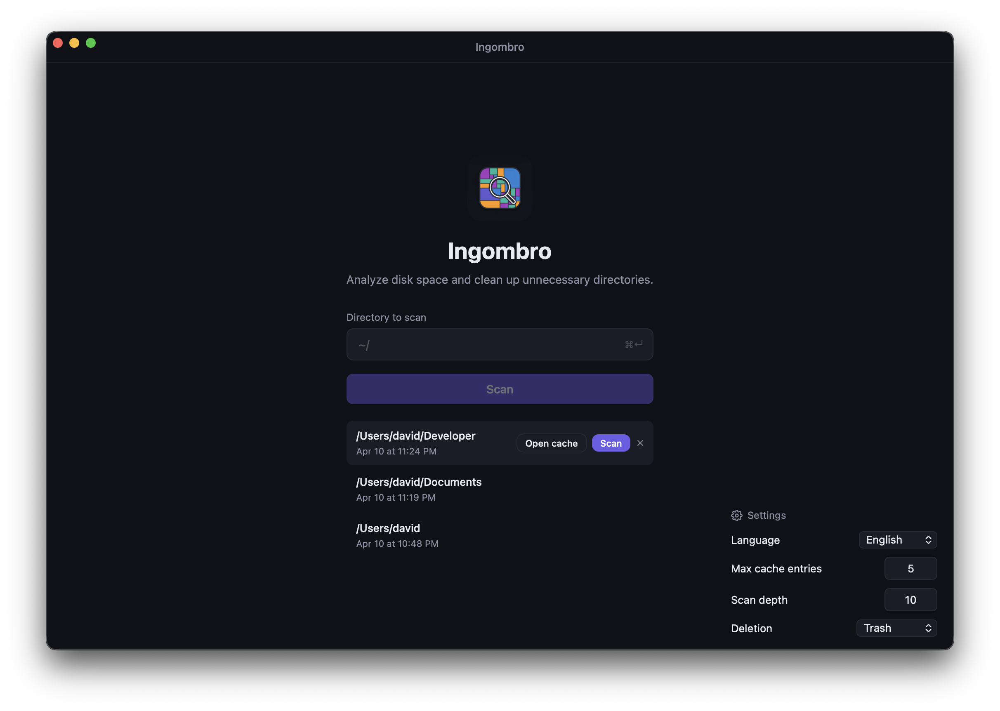
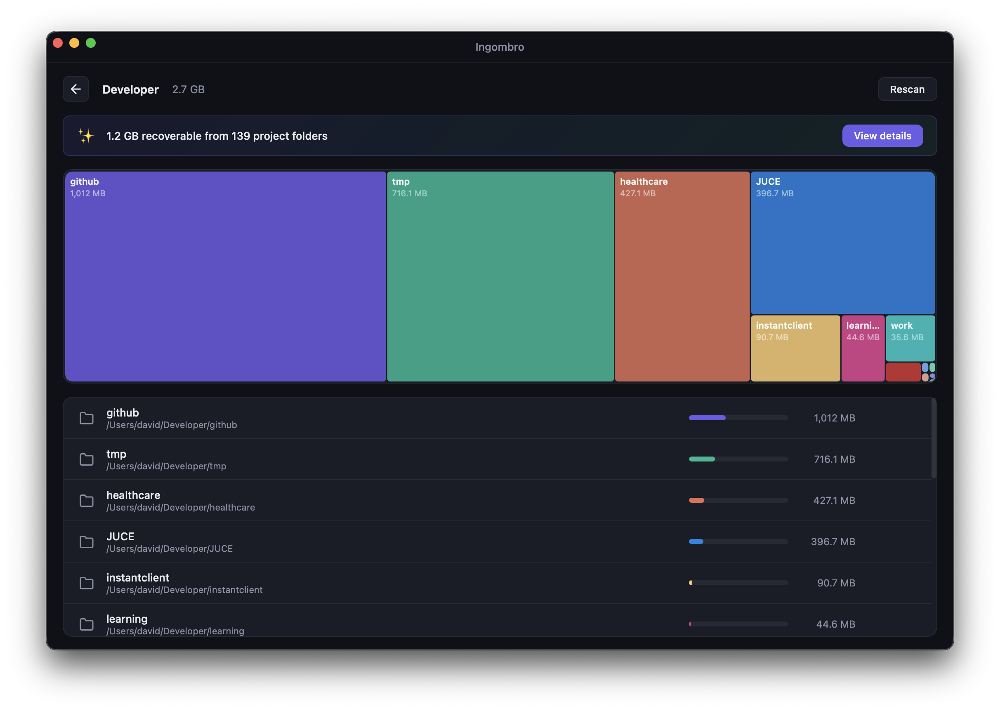
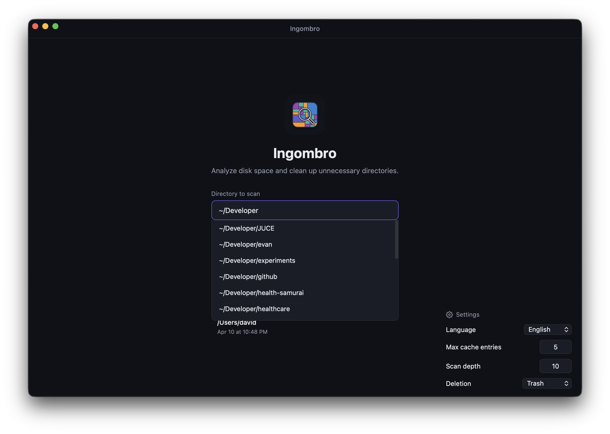
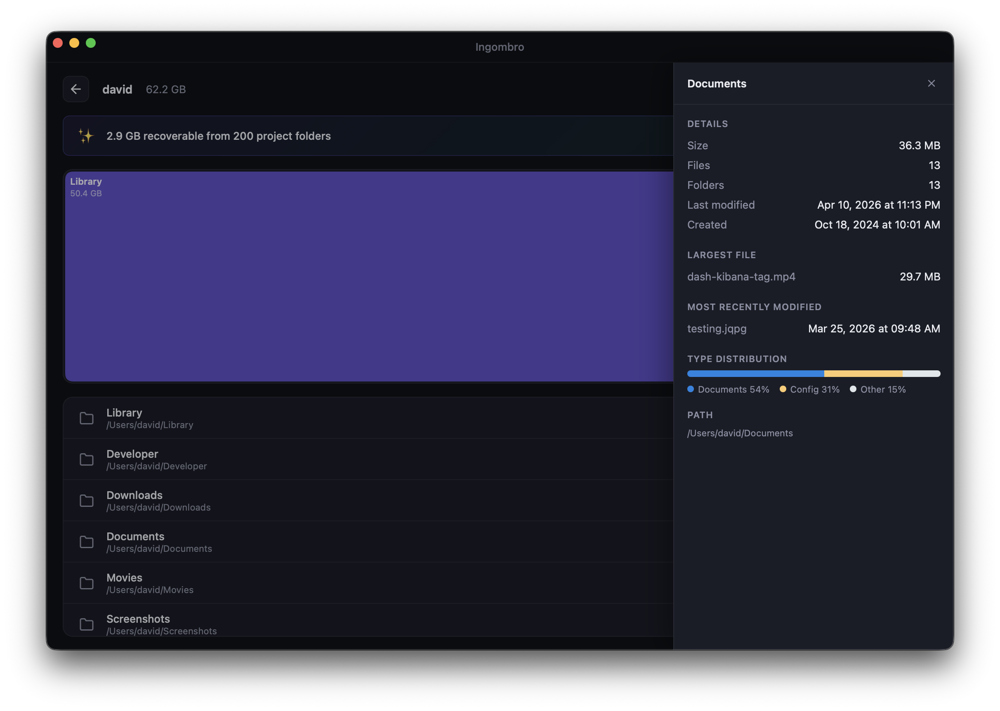
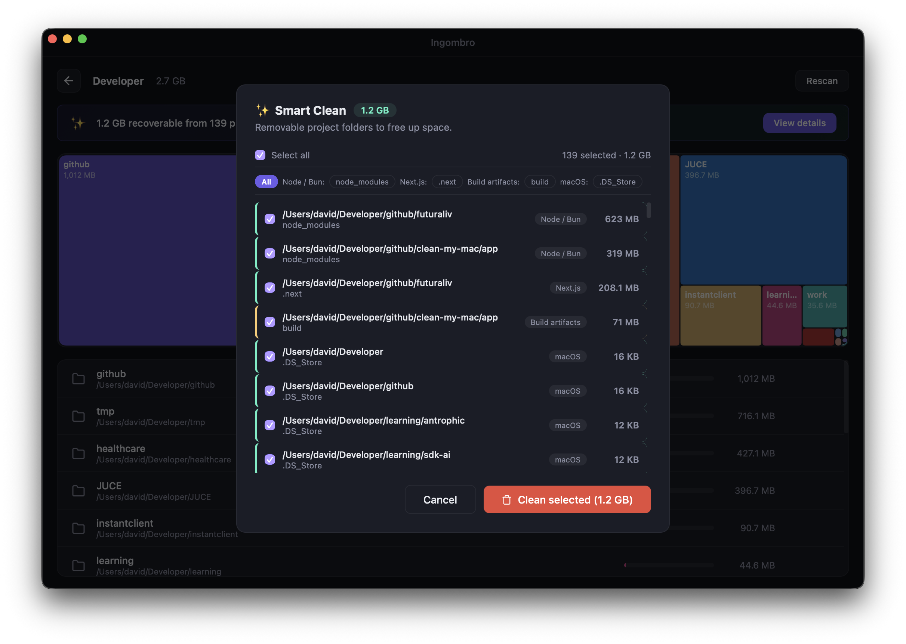
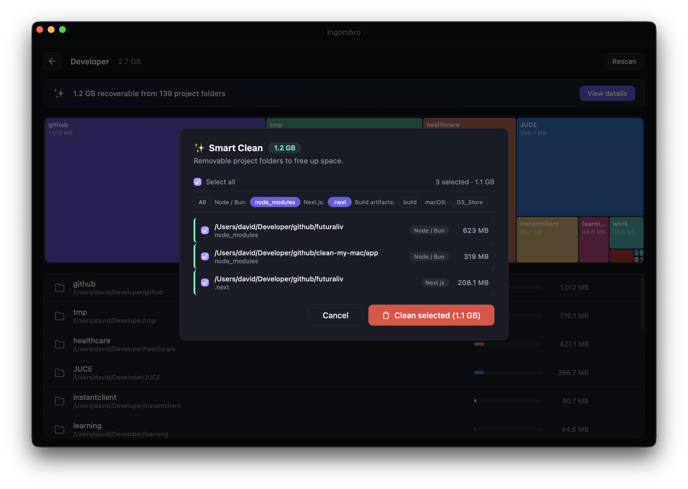

# Ingombro

<p align="center">
  
</p>

<p align="center">
  Analyze disk space and clean up unnecessary directories.
</p>

---

Ingombro is a macOS desktop app built with [Electrobun](https://electrobun.dev/) and [Bun](https://bun.sh/). It scans any directory, visualizes disk usage with an interactive treemap, and helps you free up space by removing bloated project folders like `node_modules`, `target`, `.venv`, build caches, and more.



## Features

### Interactive treemap

Proportional visualization of disk usage. Click any folder to drill down with smooth transition animations.



### Path autocomplete

Start typing a path and get instant directory suggestions. Supports `~` expansion and nested paths.



### File and folder preview

Side panel with detailed info: size, dates, largest file, most recently modified, file type distribution chart, and text/image previews.



### Smart Clean

Automatic detection of removable folders across your projects. The banner and item list update as you navigate into subdirectories, showing only what's relevant to the current folder.

| Category | Detected folders |
|---|---|
| Node / Bun | `node_modules`, `.parcel-cache`, `.turbo` |
| Frameworks | `.next`, `.nuxt`, `.svelte-kit`, `.astro`, `.angular`, `.docusaurus` |
| Python | `__pycache__`, `.venv`, `venv`, `.tox`, `.pytest_cache`, `.mypy_cache`, `.ruff_cache`, `htmlcov` |
| Rust / Java | `target`, `.gradle` |
| Elixir | `_build`, `deps`, `.elixir_ls` |
| Zig / Haskell | `zig-cache`, `zig-out`, `.stack-work` |
| Ruby / PHP / Go | `vendor`, `.bundle` |
| iOS / Flutter | `Pods`, `.dart_tool`, `.pub-cache` |
| Build artifacts | `build`, `dist`, `.cache` |
| Infrastructure | `.terraform`, `.cdk.out`, `.serverless` |
| AI / ML | `.ipynb_checkpoints`, `mlruns`, `wandb`, `lightning_logs` |
| Design | `RECOVER`, `.affinity-autosave`, `Sketch Previews` |
| Video | `Media Cache`, `Render Cache`, `Render Files`, `proxy` |
| Music / DAW | `Bounced Files`, `Freeze Files`, `Rendered`, `fl_studio_cache` |
| macOS / Windows | `.DS_Store`, `Thumbs.db`, `Desktop.ini` |

Filter by project type, select items individually or in batch, and clean with a single click.





### Cached analysis results

Scan results and Smart Clean analysis are cached. Reopening a directory from cache loads instantly without re-scanning. A new scan automatically invalidates the previous cache.

### Internationalization

7 languages supported out of the box:

🇮🇹 Italiano · 🇬🇧 English · 🇪🇸 Español · 🇫🇷 Français · 🇩🇪 Deutsch · 🇧🇷 Português · 🇯🇵 日本語

Automatic detection of system language with manual override.

## Requirements

- macOS
- [Bun](https://bun.sh/) ≥ 1.0
- [Electrobun](https://electrobun.dev/) CLI

## Quick start

```bash
# Install dependencies
bun install

# Start in development mode
bun run dev

# Canary build
bun run build:canary

# Stable build
bun run build
```

## Installation

Download the latest release from the [Releases](../../releases) page and drag the app into your Applications folder.

> ⚠️ **macOS Security Notice**
>
> Ingombro is not signed with an Apple Developer certificate, so macOS may show a **"damaged and can't be opened"** warning.
>
> To fix this, open Terminal and run:
>
> ```bash
> xattr -d com.apple.quarantine /Applications/Ingombro.app
> ```
>
> Learn more about [macOS Gatekeeper](https://support.apple.com/en-us/guide/security/sec5599b66df/web).

## Settings

Accessible from the home screen, saved in `~/.ingombro/settings.json`:

- **Language** — UI language (auto-detected or manual)
- **Max cache entries** — number of scans kept in cache
- **Scan depth** — maximum recursion levels
- **Delete mode** — macOS Trash or permanent deletion

## Stack

- **Runtime**: [Bun](https://bun.sh/)
- **Desktop framework**: [Electrobun](https://electrobun.dev/)
- **Language**: TypeScript
- **UI**: Vanilla HTML/CSS + Canvas (treemap)

## License

See [LICENSE](LICENSE).
